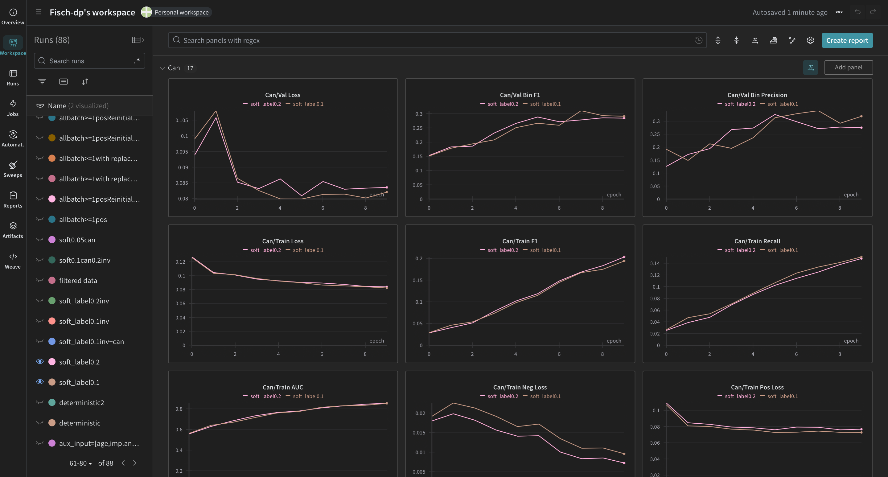
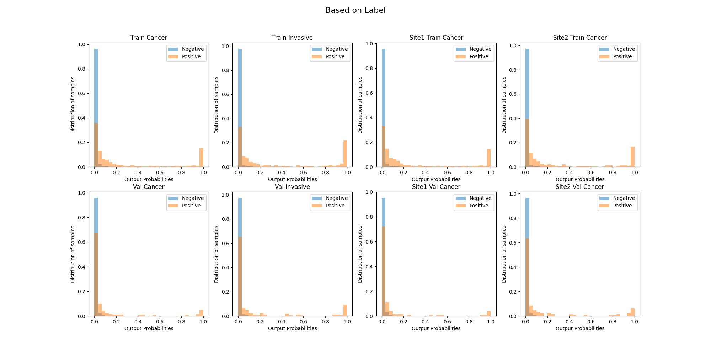

[comment]: <> (# RSNA Screening Mammography Breast Cancer Detection Competition Solution)

<!-- PROJECT LOGO -->

<p align="center">

  <h1 align="center"> RSNA Screening Mammography Breast Cancer Detection Competition Solution
  </h1>
  <p align="center">
   <strong>Oscar Chan</strong>
  </p>

<p align="center">
This is my solution for <a href=https://www.kaggle.com/c/rsna-miccai-brain-tumor-radiogenomic-classification/overview>RSNA Screening Mammography Breast Cancer Detection Competition</a>. This repository aims to provide a simple and clean codebase for training and inference. The code is written in PyTorch. I hope this repository can help you to get started with the competition. If you find this repository helpful, please give it a star. Thank you! 
</p>
<br>

# Getting Started
## Installation
Install the dependencies by running the following command:
```bash
pip install -r requirements.txt
```

## Run

To run and track the training progress, you may use the following command:
```bash
wandb login --verify ## Your Wandb api key ##
python main.py
```
Or you may run the code with jupyter notebook/colab/kaggle with the file named main.py

## Data
The data is available on [Kaggle](https://www.kaggle.com/c/rsna-miccai-brain-tumor-radiogenomic-classification/data). You can download the data and put it in the `data` folder.

Set `cfg.data_dir` in `config.py` to the path of the data folder. The dataset class is available in `Dataset.py`

## Model
The model calls API from timm, which is a pytorch model library. The model class is available in `Model.py`

## Dicom to Image Preprocessing
It is recommended to use available kaggle dataset for this part, for more customization, you may refer to `Dicom2Image.ipynb`. 

Since Dicom images are encoding in more than 8 bits, thus it is necessary to apply VOI LUT function to select important colour ranges of the images, and then convert the images to 8 bits which is more suitable for observation and possibily easierfor training. 

In this step, image is resized to running size(512x256/1024x512), and then saved as png file, this will reduce computational cost and running time for training.\

Dicom2Img: credit to @hengck23 (https://www.kaggle.com/code/hengck23/3hr-tensorrt-nextvit-example)\
Crop ROI: credit to @vslaykovsky : "RSNA: Cut Off Empty Space from Images" (https://www.kaggle.com/code/vslaykovsky/rsna-cut-off-empty-space-from-images)
## Training
This project implements a trainer for training the model. The trainer is available in `Trainer.py`. You can set the hyperparameters in `config.py` and run 
```bash
python main.py
```
to train and evaluate the model.

There are serveral input parameters in trainer you need to specify:
1. `cfg`: the config file
2. `df`: the dataframe of the entire dataset(i.e. cfg.data_df), it is first preprocessed in `main.py` before passing into the trainer
3. `model`: the model you want to train
4. `scaler`: the scaler you want to use to scale the gradient
5. `loss_calculation`: when there are multiple losses, you can specify how to calculate the loss
6. `loss_functions`: the loss functions for each output class you want to use
7. `test`: whether it is in test mode, When `test` is True, val_df will become `test_df` 
8. `test_df`: the dataframe of the test dataset, it is first preprocessed in `main.py` before passing into the trainer

To fit the model after initializing the trainer as `ter`, you may run:
```python
best_metrics = ter.fit()
```
The best model will be saved according to best thresholded F1 score and loss to `cfg.model_dir`. The best model(according to best thresholded F1 score) will be returned.

To evaluate the model, you may run:
```python
train_df = ter.predict("Train", best=True)
val_df = ter.predict("Val", best=True)
train_df.to_csv(f"train.csv", index=False)
val_df.to_csv(f"val.csv", index=False)

train_wandb_table = wandb.Table(dataframe=train_df)
val_wandb_table = wandb.Table(dataframe=val_df)
wandb.run.log({"Eval on Train": train_wandb_table})
wandb.run.log({"Eval on Val": val_wandb_table})

get_probability_hist([train_df, val_df], ter.writer, bins=30)
get_corr_matrix([train_df, val_df], ter.writer)
get_PR_curve([train_df, val_df], ter.writer, mode="single", best_metric=ter.best_metric)
```
## Inference
To inference the model, you may run `Inference.ipynb` on kaggle to infer on the hidden test dataset.

# Results
## Best Model
### Best Models score summary:
512x256\
• Public LB(Leaderboard score): 0.29\
• Private lb: 0.26\
• Local Score: 0.3389

1024x512\
• Public LB: 0.39\
• Private lb: 0.31\
• Local Score: 0.3726

Since resources are limited, it was difficult to tune hyperparameters, most of the settings in 512x256 was directly transfered to 1024x512 while only scaling down learning rate due to batch size, therefore performance of 1024x512 model was not good. There are still huge room for improvement, especially when top solutions achieve 0.5+ on private lb with the scale of 2048. 
## Training
• <b>GPU:</b> kaggle GPU, 1x P100 16GB\
• <b>Optimizer:</b> AdamW\
• <b>Scheduler:</b> OneCycle - no warm up, cosine annealing\
• <b>Learning rate:</b> 3e-4\
• <b>Weight decay:</b> 5e-2\
• <b>Image size:</b> 512x256, 1 channel\
• <b>Train Dataset:</b> rearranged each epoch\
• <b>Batch size:</b> 64\
• <b>Mixed precision (AMP):</b> done with autocast()\
• <b>Gradient clipping:</b> clipped to 10.0 with GradScaler()\
• <b>Loss function:</b> BCEWithLogitsLoss with pos_weight = 2\
• <b>Epochs:</b> 10, model was trained for 10 epochs, best model was saved according to best thresholded F1 score and loss each epoch, best model may only be trained for 5-7 epochs.\
• <b>Label Smoothing:</b> 0.1\
• <b>Simple Mixing:</b> difficult negative cases which requires biopsy were mixed with positive cases with a mix strength of 0.5, since some of the negative cases are difficult to distinguish from positive cases(and positive cases are rare), mixing in such way hopes to help the model learn features in difficult negative cases which also appear in positive cases.\
• <b>Resize with PIL LANCZOS/BICUBIC:</b> it was observed that resize with LANCZOS/BICUBIC gives better result than resize with INTER_LINEAR, LANCZOS was used eventually.\
• <b>Scaling up to 1024x512:</b> with same settings as 512x256, while scaling down learning rate following the decrease of batch size, it also helps to transfer the 512x256 model to 1024x512.\
• <b>Thresholding and gem pooling by site:</b> Thresholding will result in a stronger prediction, which results in higher score, gem pooling, helps better aggregate multiple predictions from different images of the same patient, which also results in higher score. Also, it was observed that site1 predictions have much lower F1 score than site2, often improving score in one site comes at the expense of the other, thus, after training, we obtain best threshold and gem pooling for each site from validation, and apply them to testing.
## Models
• EfficientNetV2 small (timm - checkpoint: tf_efficientnetv2_s), other architechtures were tested but no clear improvement was observed. \
• Auxiliary input was concatenated to the extracted feature vector\
• There are two classifer, one for the main task, one for the auxiliary task, the model first outputs the auxiliary task, concatenate the output to the feature vector, and then output the main task. The model works better than a single classifier returns all outputs at once with a single classifier.\
• Avg/L2 are better than Max/learnable Pooling\
• drop_path_rate=0.3 and drop_rate=0.2(original setting)\
• Auxiliary Input: "age", "implant", "site"\
• Auxiliary Task: "invasive"\

## Image Augmentation
```python
cfg.Trans = A.Compose([
    # flip
    A.HorizontalFlip(p=0.5),
    A.VerticalFlip(p=0.5),

    # contrast
    A.OneOf([
        A.RandomToneCurve(scale=0.3, p=0.5),
        A.RandomBrightnessContrast(brightness_limit=(-0.1, 0.2), contrast_limit=(-0.4, 0.5), brightness_by_max=True, always_apply=False, p=0.5),
        A.RandomGamma(gamma_limit=(80, 120), eps=None, always_apply=False, p=0.5),
    ], p=0.5),

    # Noise
    A.GaussNoise(var_limit=(10.0, 50.0), mean=0, per_channel=True, always_apply=False, p=0.5),

    # geometric
    A.OneOf([
        A.ShiftScaleRotate(shift_limit=None, scale_limit=[-0.15, 0.15], rotate_limit=[-30, 30], interpolation=cv2.INTER_LINEAR,
                           border_mode=cv2.BORDER_CONSTANT, value=0, mask_value=None, shift_limit_x=[-0.1, 0.1],
                           shift_limit_y=[-0.2, 0.2], rotate_method='largest_box', p=0.6),
        A.ElasticTransform(alpha=1, sigma=20, alpha_affine=10, interpolation=cv2.INTER_LINEAR, border_mode=cv2.BORDER_CONSTANT,
                           value=0, mask_value=None, approximate=False, same_dxdy=False, p=0.2),
        A.GridDistortion(num_steps=5, distort_limit=0.3, interpolation=cv2.INTER_LINEAR, border_mode=cv2.BORDER_CONSTANT,
                         value=0, mask_value=None, normalized=True, p=0.2),
    ], p=0.5),

    # random erase
    A.CoarseDropout(max_holes=6, max_height=0.15, max_width=0.25, min_holes=1, min_height=0.05, min_width=0.1,
                    fill_value=0, mask_fill_value=None, p=0.25),
], p=0.9)
```
## Local validation
• <b>Metrics:</b> F1, thresholded F1, ROC_AUC, prec/recall, bce loss for whole val dataset or grouped by site, image_id, prediction_id(Main), patient_id.\

## Techniques doesn't give observable improvement
• <b>Full dataset training\
• site_1/site_2 separate models\
• Lookahead\
• Sampler:</b> no sampler was used to control postive/negative ratio, instead, pos_weight was used in loss function\
• <b>Loss function:</b> Focal loss/Triplet Loss\
• <b>Models:</b> Effnet, NextVit, Convnextv1\
• <b>Generate images with GAN:</b> difficult to train and no observable improvement\
• <b>CutMix/MixUp\
• Muti-View Model:</b> it has no clear improvement, but it is possible that it may help to improve score if it is tuned better.\
• <b>zero padding</b>

## Visualization Tools
• <b>Wandb:</b> for tracking training progress, metrics, and hyperparameters, function exactly the same as Tensorboard, while you could view the progress live.\
• <b>PR curve: compare thresholded f1 score between sites\
• Confusion Matrix:</b> it helps me to identify correlated classes and set auxiliary tasks\
• <b>Histogram:</b> it helps me to identify the distribution of the prediction, and compare against val and train set, and against sites





For PR curve and histogram, credit to @hengck23 - https://www.kaggle.com/competitions/rsna-breast-cancer-detection/discussion/378521